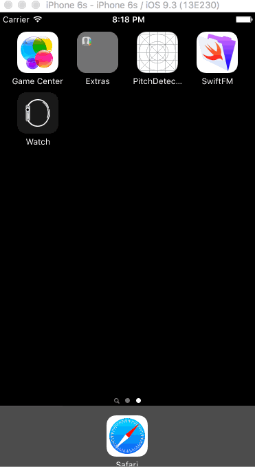
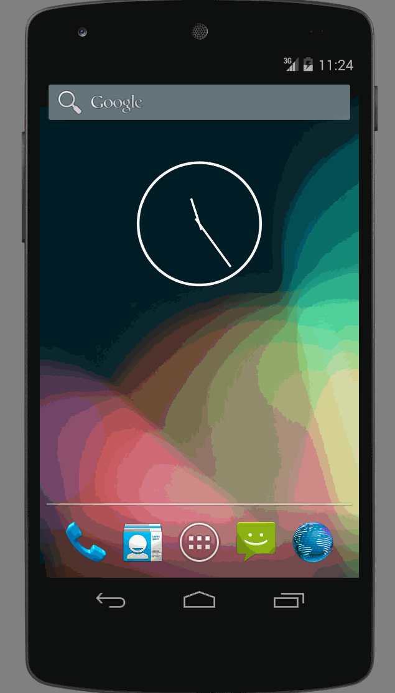

# SwiftFM-DroidFM
Demonstration of Native Mobile apps built with FileMaker data

# Installation (Assuming OS X)
1. To get started, host the SwiftFM.fmp12 database to an instance of FileMakerServer12 (or 13-15)

   *The file's credentials are*:
account: **username**
password: **password**

2. Upload the php file to `/Library/FileMaker Server/HTTPServer/htdocs/`

3. Update the php.ini so that image files (~50MB) can be uploaded - can be found here: `/Library/FileMaker Server/Web Publishing/publishing-engine/php/yosemite/lib/php.ini`
  * post_max_size
  * upload_max_filesize

4. Restart Apache Server

5. Update the Mobile projects with the proper credentials and host IP address of your FileMakerServer
  * If Swift, update the variables found in 'Variables.swift'
  * If Android, update the variables found in 'DroidFMListView.java' 

# SwiftFM

# DroidFM

